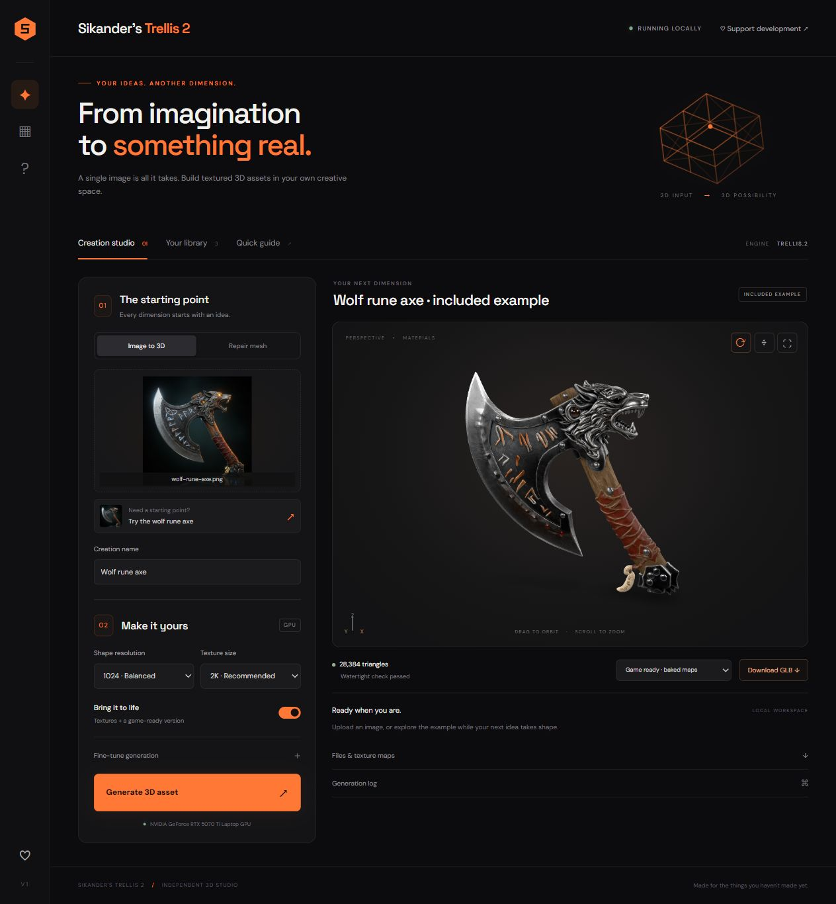
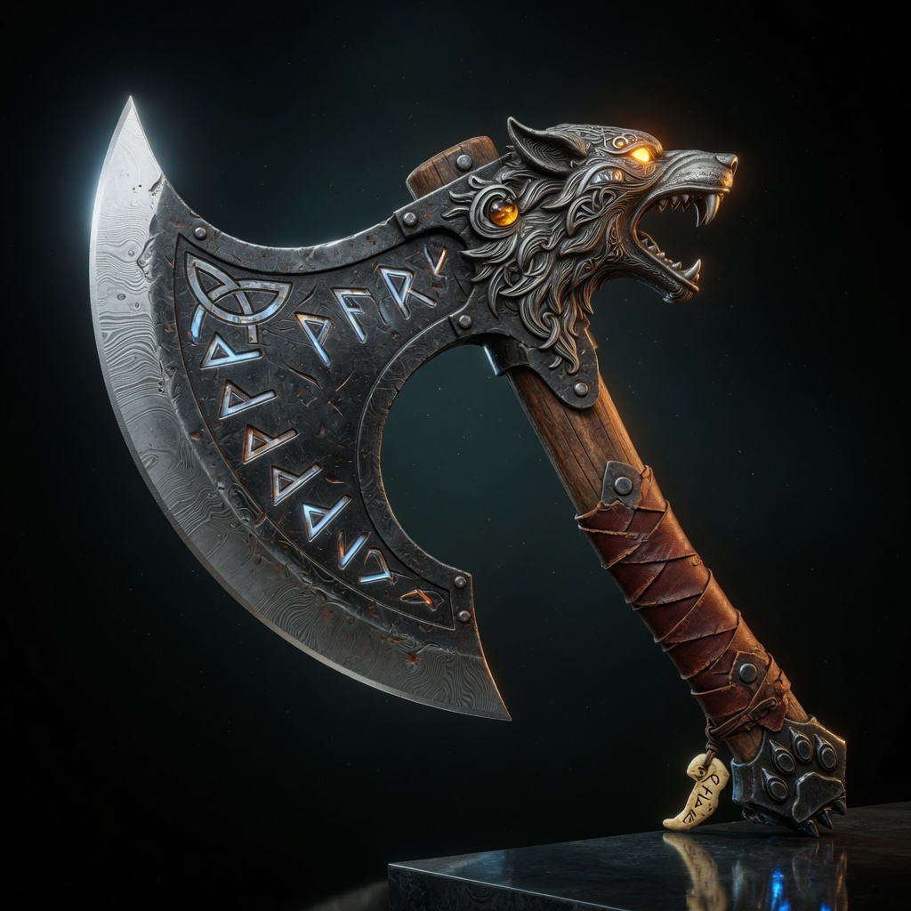
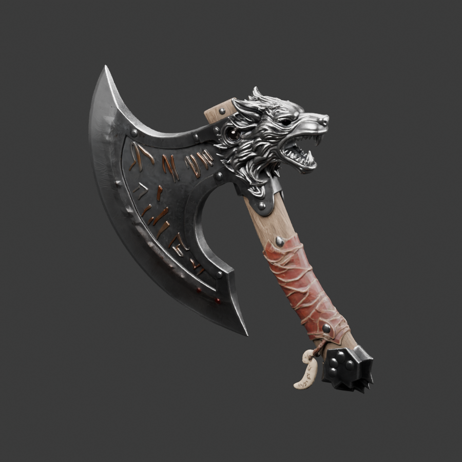

# Sikander's Trellis 2

**One image. A world of possibilities.**

[Download for Windows](https://github.com/maliksikander7889-wq/sikanders-trellis-2/releases/latest/download/sikanders-trellis-2.zip) ·
[Support development](https://paypal.me/Sikandar1Riaz)

A local Windows studio for turning images into textured 3D assets. Generate
detailed meshes, prepare smaller assets with baked maps, repair geometry,
and revisit your creations in an interactive 3D library.

Orange and black. Runs on your NVIDIA GPU. No cloud inference subscription.

## Start in one click

1. Download this repository with **Code → Download ZIP**, or clone it.
2. Extract it to a writable folder, such as `D:\SikandersTrellis2`.
3. Double-click **INSTALL.bat**.

The installer checks your GPU, installs missing Git, Blender, Microsoft C++
runtime and Python tooling, builds an isolated environment, downloads the
models, and opens the app. Windows may show installation permission prompts.
The first setup includes a large download; interrupted model downloads resume.

After setup, double-click **START.bat**. The studio opens at
<http://127.0.0.1:7860>. Keep its terminal window open while using the app.

### Hardware

| Requirement | Recommended starting point |
|---|---|
| OS | Windows 10/11, x64 |
| GPU | NVIDIA CUDA GPU; tested on RTX 5070 Ti Laptop, 12 GB VRAM |
| RAM | 32 GB; close other memory-heavy applications |
| Disk | At least 35 GB free for setup, plus space for outputs |
| Driver | Current NVIDIA driver compatible with CUDA 12.8 |
| Internet | Required for first installation and model downloads |

1024 generation is tested. 1536 and 2048 are available but need more memory
and are not verified on the test laptop. Other GPU generations require
compatible upstream binaries and have not been tested by this project.

## What you can do

- **Image to 3D:** create a detailed mesh with generated PBR materials.
- **Geometry repair:** process GLB, OBJ, PLY or STL inputs and check topology.
- **Game-ready export:** target roughly 30,000 triangles and bake six maps.
- **Interactive preview:** orbit and zoom around generated GLB models.
- **Your library:** reopen saved work, switch model versions, see topology
  results and download assets. No database or separate account required.
- **Bundled example:** explore the wolf rune axe before your first generation.

## The axe example

| Input image | Actual generated result |
|---|---|
|  |  |

[Download the textured axe GLB](examples/axe/game_ready.glb) ·
[Settings and source credit](examples/axe/README.md)

The example was generated at 1024 with seed 56 and 2048 textures. Its
game-ready model has **28,384 triangles** and passed the watertight check
after coincident UV-seam vertices were merged for measurement.

## Basic workflow

1. Open **Creation studio** and upload a clear image of one object.
2. Name your creation. Start with 1024 shape resolution and 2048 textures.
3. Leave **Generate textures + game-ready asset** enabled for materials.
4. Click **Generate 3D asset**. Progress appears in the generation log.
5. Inspect the model, check its topology status, and download your files.
6. Open **Your library** to revisit past work or the bundled example.

### Choose the right output

| File | Purpose |
|---|---|
| `textured.glb` | Detailed mesh with embedded materials |
| `game_ready.glb` | Smaller mesh with baked detail maps |
| `lowpoly.glb` | Smaller textured mesh before the final bake |
| `final.glb`, `final.ply`, `final.stl` | Geometry only, without textures |
| `maps/*.png` | Base color, normal, roughness, metallic, emission and AO |
| `*-audit.json` | Measured topology and triangle counts |
| `run.log` | Processing log for troubleshooting |

## How it works

The native TRELLIS.2 pipeline samples geometry and texture features from an
image. Quad reconstruction and WTiVo process the surface. Blender reduces
geometry, followed by vertex merging and topology checks. O-Voxel/CuMesh
projects generated materials onto the repaired surface; Bake Forger bakes
the final map set. Separate worker processes release GPU memory between stages.

The studio uses a custom HTML/CSS/JavaScript frontend, an interactive model
viewer, and a local Python/FastAPI server. See [third-party notices](THIRD_PARTY_NOTICES.md)
for source repositories, model sources, and licenses. Revisions are recorded in
`sources.lock.json` and `model-revisions.json`.

## Current limits

- Image-conditioned generation can invent or omit details, especially on hidden surfaces.
- A watertight detailed mesh does not guarantee a watertight simplified mesh.
  The library reports the status for the specific version selected.
- Repairing an existing mesh removes its original materials. AI retexturing
  of arbitrary imported meshes is not implemented.
- The target triangle count is approximate. Printing still requires checking
  scale, thickness, supports and suitability in a slicer.
- Windows/NVIDIA only in this release. CPU-only, AMD and macOS are unsupported.
- Model downloads are local; inference runs locally. The interface may request
  web fonts; system fonts are used when offline.

## Documentation

- [Installation and troubleshooting](docs/SETUP.md)
- [Usage and command-line reference](docs/USAGE.md)
- [Architecture and development](docs/DEVELOPMENT.md)
- [Third-party licenses and credits](THIRD_PARTY_NOTICES.md)

## License

Project code is provided under [GPL-3.0](LICENSE). Downloaded libraries,
model weights, and bundled example imagery retain their own licenses.

## Support development

If this app helps your work, you can [support development through PayPal](https://paypal.me/Sikandar1Riaz).
